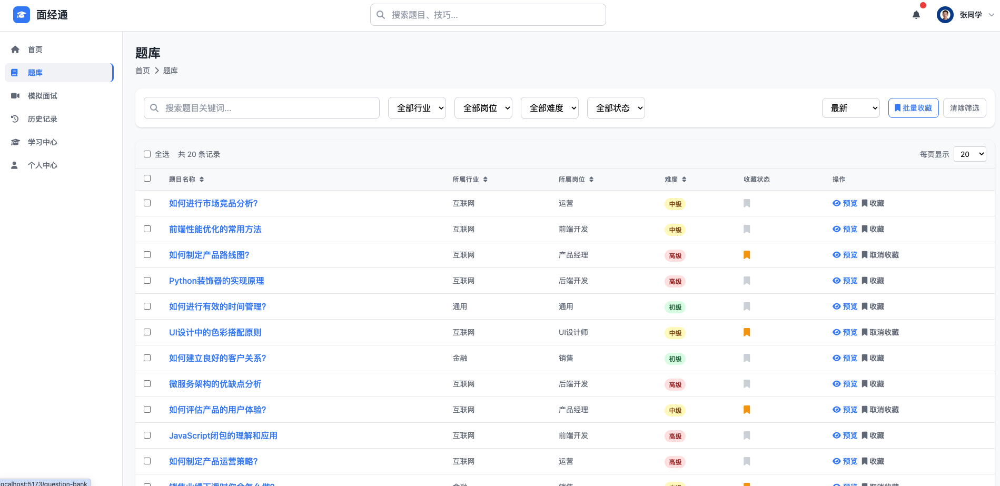
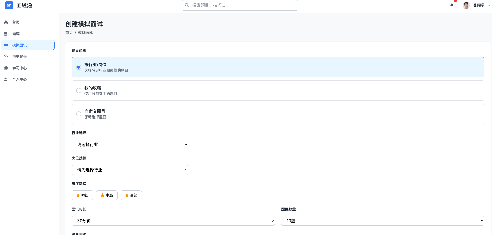
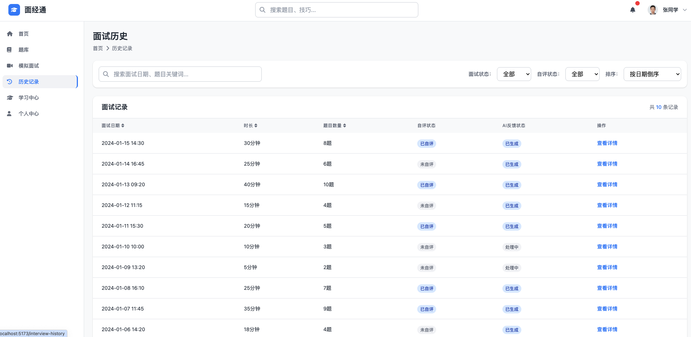
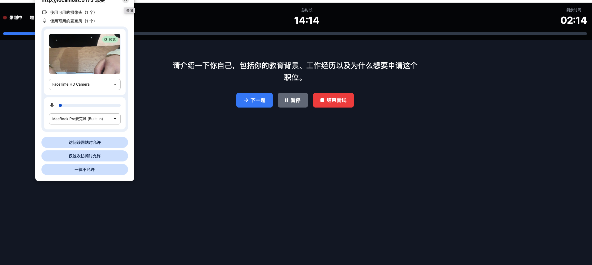

**产品名称:** ⾯经通

**产品定位:** ⼀款⾯向求职者的Web端在线视频模拟⾯试与题库学习平台，旨在帮助⽤⼾提升⾯试技能，积累⾯试经验，从⽽在真实⾯试中脱颖⽽出。

**产品愿景:** 成为求职者提升⾯试能⼒的⾸选平台，让每⼀次模拟都成为成功的预演。

**产品⽬标:**
提供全⾯、⾼质量的⾯试题库，覆盖多⾏业、多岗位。提供沉浸式的视频模拟⾯试体验，帮助⽤⼾熟悉⾯试流程。通过AI分析和⾃评功能，提供个性化的⾯试反馈和改进建议。提升⽤⼾⾯试通过率，缩短求职周期。

```bash
//请将node升级到20+
npm install

npm run dev
```







